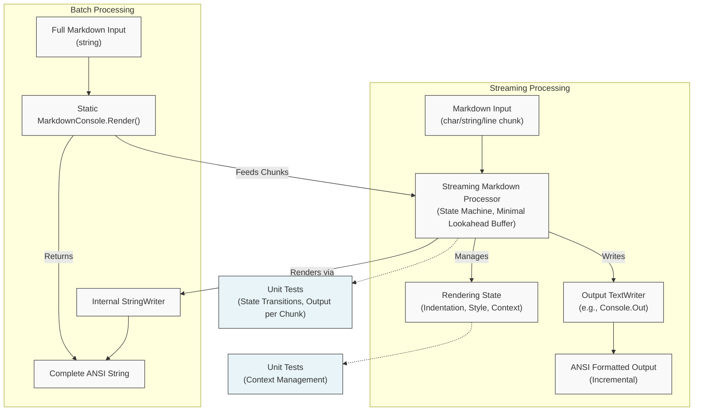

# ConsoleInk.Net: Architectural Design & Implementation Plan

## Executive Summary

This document outlines the architecture for a robust, testable, and performant C#/.NET library for rendering Markdown in console applications. The solution provides a clean API for both C# applications and PowerShell scripts, with no external dependencies beyond the .NET BCL. The architecture is designed as streaming-first to support true incremental processing of Markdown content.

## Architecture Overview

The architecture uses a streaming-first design with a state machine processor that handles Markdown incrementally and renders directly as it processes content. This approach is optimized for line-by-line rendering and enables live display of content as it arrives.



## Core Components

### 1. Streaming Markdown Processor
- **Responsibility:** Process Markdown input incrementally (character by character, line by line, or in small chunks)
- **Implementation:** State machine tracking the current context (paragraph, heading, list, code block, etc.)
- **Approach:** Maintains minimal lookahead buffer for resolving ambiguities (e.g., Setext headings)
- **Testing:** Input sequences of chunks → Assert output matches expected ANSI, assert final state is correct

### 2. Rendering State
- **Design:** Mutable context tracking indentation, current styling, nesting levels, theme settings
- **Responsibility:** Provides the current state for the rendering actions to apply correct formatting
- **Key Tracked States:** 
  - Active ANSI styles (bold, italic, colors)
  - Indentation level and prefixes for nested structures
  - Context stack (list types, blockquote nesting, etc.)
  - Console width for line wrapping
  - Link reference definitions found during processing
- **Testing:** Assert correct state transitions for various inputs

### 3. Rendering Actions
- **Design:** Direct output generation based on state machine transitions
- **Responsibility:** Write ANSI-formatted text to the output TextWriter
- **Key Actions:**
  - StartHeading(level) / EndHeading()
  - StartParagraph() / EndParagraph()
  - WriteText(text, wrap) - with word-wrapping
  - StartList(type) / EndList()
  - StartCodeBlock(language) / EndCodeBlock()
- **Testing:** Assert correct ANSI output for specific state transitions

### 4. Public API & Packaging
- **Core Library API (ConsoleInk.Net):**
```csharp
// Primary streaming writer - follows TextWriter pattern
public class MarkdownConsoleWriter : TextWriter {
    // Constructor takes the destination writer
    public MarkdownConsoleWriter(TextWriter outputWriter, MarkdownRenderOptions options = null);
    
    // Override TextWriter methods
    public override void Write(char value);
    public override void Write(string value);
    public override void WriteLine(string value);
    public override void WriteLine();
    
    // Crucial method to signal end of input
    public void Complete();
    
    // Standard overrides
    public override void Flush();
    public override Encoding Encoding { get; }
}

// Static helper for simple batch processing
public static class MarkdownConsole {
    // Primary rendering methods
    public static string Render(string markdownText, MarkdownRenderOptions options = null);
    
    // Advanced overloads
    public static void Render(string markdownText, TextWriter outputWriter, MarkdownRenderOptions options = null);
    public static void Render(TextReader markdownReader, TextWriter outputWriter, MarkdownRenderOptions options = null);
}

// Configuration class
public class MarkdownRenderOptions {
    public int ConsoleWidth { get; set; } // Defaults to Console.WindowWidth if available, else 80
    public bool EnableColors { get; set; } = true;
    public ConsoleTheme Theme { get; set; } = ConsoleTheme.Default;
    public bool StripHtml { get; set; } = true;
    // Further configuration options...
}

// Theme configuration 
public class ConsoleTheme {
    public static ConsoleTheme Default { get; }
    public static ConsoleTheme Monochrome { get; }
    
    public ConsoleColor HeadingColor { get; set; }
    public ConsoleColor LinkColor { get; set; }
    public ConsoleColor CodeColor { get; set; }
    public ConsoleColor CodeBackgroundColor { get; set; }
    // Other theme properties...
}
```

- **PowerShell Module (ConsoleInk.PowerShell):**
```powershell
# Primary cmdlet with pipeline support
function ConvertTo-Markdown {
    [CmdletBinding(DefaultParameterSetName='Text')]
    param(
        [Parameter(Mandatory=$true, Position=0, ValueFromPipeline=$true, ParameterSetName='Text')]
        [string[]]$MarkdownText, # Processed line-by-line in the Process block
        
        [Parameter(Mandatory=$true, ParameterSetName='Path')]
        [string]$Path,
        
        [Parameter()]
        [int]$Width = (Get-Host).UI.RawUI.WindowSize.Width,
        
        [Parameter()]
        [switch]$NoColor,
        
        [Parameter()]
        [ValidateSet('Default', 'Monochrome', 'Bright', 'Pastel')] # Assuming these map to ConsoleTheme instances
        [string]$Theme = 'Default'
    )
    
    begin {
        # Determine input source based on ParameterSetName
        Write-Verbose "Starting Markdown Conversion. Parameter Set: $($PSCmdlet.ParameterSetName)"
        
        # Prepare Render Options
        $renderOptions = [ConsoleInk.Net.MarkdownRenderOptions]::new()
        $renderOptions.ConsoleWidth = $Width
        $renderOptions.EnableColors = -not $NoColor.IsPresent
        # TODO: Map $Theme string to the appropriate ConsoleTheme instance
        # $renderOptions.Theme = [ConsoleInk.Net.ConsoleTheme]::($Theme) # Example if themes are static properties

        # Initialize the core Markdown writer. 
        # We might write to an internal StringWriter first if we need the full result before outputting.
        # For true pipeline streaming to console, use [System.Console]::Out. Let's assume batching pipeline input for simplicity here.
        $internalStringWriter = [System.IO.StringWriter]::new()
        $markdownWriter = [ConsoleInk.Net.MarkdownConsoleWriter]::new($internalStringWriter, $renderOptions)

        # Prepare input source
        if ($PSCmdlet.ParameterSetName -eq 'Path') {
            if (-not (Test-Path -LiteralPath $Path -PathType Leaf)) {
                Throw "File not found: $Path"
            }
            # File input will be read in Process block
        } else { # Text parameter set (Pipeline)
            # Initialize buffer for pipeline input
            $pipelineInputBuffer = [System.Text.StringBuilder]::new()
        }
    }
    
    process {
        # Process input based on parameter set
        if ($PSCmdlet.ParameterSetName -eq 'Path') {
            # Read the file line by line and write to the Markdown writer
            try {
                $reader = [System.IO.StreamReader]::new($Path)
                while (($line = $reader.ReadLine()) -ne $null) {
                    $markdownWriter.WriteLine($line)
                }
            } finally {
                $reader?.Dispose()
            }
            # We process the whole file in the 'process' block when -Path is used.
        } else { # Text parameter set (Pipeline)
            # Append each line from pipeline to the buffer
            foreach ($line in $MarkdownText) {
                $pipelineInputBuffer.AppendLine($line) | Out-Null
            }
        }
    }
    
    end {
        Write-Verbose "Finalizing Markdown Conversion."
        # If processing pipeline input, write the buffered content now
        if ($PSCmdlet.ParameterSetName -eq 'Text') {
            $markdownWriter.Write($pipelineInputBuffer.ToString())
        }
        
        # Signal end of input to the writer
        $markdownWriter.Complete() 
        $markdownWriter.Flush() # Ensure all data is processed and written to internal writer
        
        # Output the final rendered string from the internal writer
        $internalStringWriter.ToString()
        
        # Dispose disposable objects
        $markdownWriter.Dispose() # Assuming MarkdownConsoleWriter is IDisposable
        $internalStringWriter.Dispose()
    }
}

# Convenience cmdlet for direct viewing of markdown files
function Show-Markdown {
    [CmdletBinding()]
    param(
        [Parameter(Mandatory=$true, Position=0)]
        [string]$Path,
        
        [Parameter()]
        [int]$Width = (Get-Host).UI.RawUI.WindowSize.Width,
        
        [Parameter()]
        [switch]$NoColor,
        
        [Parameter()]
        [ValidateSet('Default', 'Monochrome', 'Bright', 'Pastel')] # Assuming these map to ConsoleTheme instances
        [string]$Theme = 'Default'
    )
    
    begin {
        # Validate path
        if (-not (Test-Path -LiteralPath $Path -PathType Leaf)) {
            Throw "File not found: $Path"
        }

        # Prepare Render Options
        $renderOptions = [ConsoleInk.Net.MarkdownRenderOptions]::new()
        $renderOptions.ConsoleWidth = $Width
        $renderOptions.EnableColors = -not $NoColor.IsPresent
        # TODO: Map $Theme string to the appropriate ConsoleTheme instance
        # $renderOptions.Theme = [ConsoleInk.Net.ConsoleTheme]::($Theme) # Example

        # Initialize MarkdownConsoleWriter targeting Console.Out directly for immediate display
        $outputWriter = [System.Console]::Out
        # NOTE: We don't dispose Console.Out
        $markdownWriter = [ConsoleInk.Net.MarkdownConsoleWriter]::new($outputWriter, $renderOptions)
    }
    
    process {
        # Read file line by line and write directly to the console via the Markdown writer
        try {
            $reader = [System.IO.StreamReader]::new($Path)
            while (($line = $reader.ReadLine()) -ne $null) {
                $markdownWriter.WriteLine($line)
                # Output happens incrementally here
            }
        } finally {
            $reader?.Dispose()
        }
    }
    
    end {
        # Signal end of input and flush
        $markdownWriter.Complete()
        $markdownWriter.Flush() # Ensure final content is flushed to Console.Out
        # Dispose the writer if it holds resources (e.g., buffers), but not Console.Out
        # $markdownWriter.Dispose() # Assuming MarkdownConsoleWriter is IDisposable
    }
}
```

## Markdown Feature Requirements

# Generic Markdown Features and Rules for Parser/Renderer Implementation

This document outlines standard and widely-adopted Markdown features relevant for building a general-purpose parser and rendering engine, suitable for contexts like a console, and includes considerations for common patterns seen in LLM interactions.

## I. Core Markdown Syntax (CommonMark/GFM Baseline)

1.  **Headings:**
    *   ATX style (`# H1`, `## H2`, etc.)
    *   Setext style (underlines with `=` for H1, `-` for H2).
2.  **Paragraphs:** Blocks of text separated by one or more blank lines.
3.  **Line Breaks:**
    *   Soft breaks (single newline, usually rendered as a space).
    *   Hard breaks (often require two spaces at the end of a line or a literal backslash `\`). Rendering might vary (e.g., actual newline vs. space in console).
4.  **Emphasis:**
    *   Italic: `*italic*` or `_italic_`.
    *   Bold: `**bold**` or `__bold__`.
    *   Combined: `***bold italic***` or `___bold italic___`.
    *   Intra-word emphasis rules (e.g., `a*b*c` vs. `a *b* c`).
5.  **Blockquotes:**
    *   Lines starting with `>`.
    *   Nested blockquotes (`>>`).
    *   Lazy continuation (subsequent lines don't strictly need `>`).
    *   Other Markdown elements inside blockquotes.
6.  **Lists:**
    *   Unordered: Using `*`, `-`, or `+` as markers.
    *   Ordered: Using numbers followed by `.` or `)` (e.g., `1.`, `2)`). Start number matters.
    *   Nested lists (indentation rules, typically 2 or 4 spaces).
    *   Loose vs. Tight lists (presence of blank lines between items affects spacing).
    *   Other Markdown elements within list items.
7.  **Code:**
    *   Inline code: Using backticks `` `code` ``. Handling literal backticks within inline code.
    *   Fenced code blocks: Using triple backticks ````` or triple tildes `~~~`. Optional language identifier (e.g., `````python). Content is treated as preformatted text.
    *   Indented code blocks: Lines indented by 4 spaces or 1 tab.
8.  **Horizontal Rules:** `---`, `***`, `___` on a line by themselves (with optional spaces). Often rendered with appropriate characters in a console (`---`, `***`).
9.  **Links:**
    *   Inline: `[Link text](URL "Optional title")`. Rendering in console might show text and URL separately, or just text.
    *   Reference-style: `[Link text][label]` and `[label]: URL "Optional title"` elsewhere. Collapsed (`[label][]`) and shortcut (`[label]`) variations.
    *   Autolinks: `<URL>` or `<email@example.com>`. GFM also auto-links bare URLs (sometimes).
10. **Images:** Similar syntax to links but prefixed with `!`.
    *   Inline: ``. Console rendering might show Alt text, path, or both.
    *   Reference-style: `![Alt text][label]` and `[label]: /path/to/image.jpg "Optional title"`.
11. **Escaping:** Using `\` to escape characters that have special Markdown meaning (e.g., `\*` renders a literal asterisk).
12. **HTML:**
    *   Handling raw HTML blocks and inline HTML tags. Often stripped or ignored in console renderers, but parsing is needed to identify them.
    *   Security: Sanitization is crucial if any HTML is processed.

## II. Common GitHub Flavored Markdown (GFM) Extensions

13. **Tables:**
    *   Using pipes `|` for columns and hyphens `-` for the header separator row.
    *   Alignment syntax using colons `:` in the header separator row.
    *   Markdown formatting within table cells.
    *   Escaping pipe characters `\|` within cells. Console rendering often uses box-drawing characters or aligned text.
14. **Task Lists:**
    *   Syntax: `- [ ] Incomplete` and `- [x] Complete` within list items.
    *   Console rendering typically uses `[ ]` and `[x]` or similar markers.
15. **Strikethrough:** Using double tildes `~~strikethrough~~`. Console rendering might use ANSI escape codes or simply ignore it.

## III. LLM-Specific Markdown Considerations & Other Extensions

*This section covers features/patterns often generated or understood by LLMs, though not always part of a strict standard. Many derive from web-focused Markdown rendering.*

16. **Syntax Highlighting Hints:** LLMs frequently use language identifiers in fenced code blocks (e.g., `````python) with the expectation that the renderer will apply syntax highlighting. Console renderers might support this via ANSI codes or ignore it.
17. **Mathematical Notation (LaTeX/MathJax):**
    *   Inline math: `$E = mc^2$`.
    *   Block math: `$$ \int_0^\infty e^{-x^2} dx = \frac{\sqrt{\pi}}{2} $$`.
    *   LLMs often generate this, expecting rendering via libraries like MathJax or KaTeX. Console renderers typically display the raw LaTeX source.
18. **Diagrams as Code (Mermaid, etc.):** LLMs may generate diagram definitions (like Mermaid, PlantUML) within specific code blocks (e.g., `````mermaid), expecting graphical rendering. Console renderers typically show the raw definition.
19. **Footnotes:**
    *   Syntax: `Text[^1]` and `[^1]: Footnote details.`. While part of some Markdown specs, LLMs may generate or need to parse these.
20. **Definition Lists:** (Less common, but sometimes seen)
    *   Syntax: Term\n: Definition line 1\n: Definition line 2
21. **Extended HTML Usage:** LLMs might generate or process HTML beyond basic tags, such as `<details>`, `<summary>`, `<sub>`, `<sup>`, for richer formatting, which standard Markdown parsers might handle differently or strip.
22. **Lax Syntax Tolerance:** LLM-generated Markdown might occasionally have minor syntax variations or errors (e.g., inconsistent list indentation, improper nesting). A robust parser should ideally handle common variations gracefully or fail predictably without crashing.
23. **Implicit Structuring:** LLMs might use formatting like **bold text** on its own line as a pseudo-heading, which isn't standard but common practice in generated text. Rendering engines might need heuristics to interpret this or just render it as bold text.

## IV. General Considerations for Parsing/Rendering

*   **Ambiguity Resolution:** Defining clear precedence rules (e.g., is `***` bold inside italic or vice-versa?). CommonMark spec provides detailed rules.
*   **Performance:** Efficient parsing algorithms are needed, especially for large documents.
*   **Extensibility:** Designing the parser/renderer to potentially accommodate future Markdown extensions or variations.
*   **Error Handling:** How to handle malformed or ambiguous syntax gracefully.
*   **Context Awareness:** Rendering *must* adapt to the target environment (e.g., console capabilities - ANSI colors, box drawing characters, width).
*   **Character Encoding:** Handling various character encodings (UTF-8 is standard).
*   **Normalization:** Handling different line ending types (CRLF, LF).

# Implementation Plan and Development Strategy

## Phase 1: Core Streaming Engine & State
1. **Set up project structure**
   - Core library project
   - Test project with xUnit
   - PowerShell module project
2. **Implement core state management**
   - `RenderingState` class
   - `MarkdownRenderOptions` and `ConsoleTheme` classes
3. **Implement streaming processor foundation**
   - Basic state machine framework
   - Character/line processing pipeline
   - Core state transitions for basic elements:
     - Paragraphs and text
     - Line breaks
     - Simple code blocks
4. **Implement rendering actions**
   - Basic ANSI handling
   - Text output with wrapping
   - Core TextWriter implementation for `MarkdownConsoleWriter`
5. **Unit tests**
   - State transitions
   - Output verification for simple cases

## Phase 2: Streaming API & Basic Markdown Features
1. **Complete MarkdownConsoleWriter implementation**
   - Full TextWriter implementation
   - Buffer management for efficient character handling
   - Complete() method for finalizing state
2. **Implement static MarkdownConsole class**
   - Batch rendering using the streaming engine
   - Configuration handling
3. **Add support for more Markdown features**
   - Headings (ATX style, Setext)
   - Emphasis (bold, italic)
   - Blockquotes
   - Basic lists (unordered, ordered)
4. **Improve testing**
   - Test MarkdownConsoleWriter with various input patterns
   - Unit tests for each Markdown feature
   - Integration tests with common Markdown patterns

## Phase 3: Advanced Features & PowerShell Support
1. **Implement more complex Markdown features**
   - Links and image alt text
   - Nested lists
   - Advanced code blocks with language identifiers
   - Tables (with special consideration for streaming limitations)
   - Task lists
2. **Handle special cases**
   - HTML handling (stripping or basic rendering)
   - Escaping and backslash handling
   - Reference-style links
3. **Implement PowerShell module**
   - ConvertTo-Markdown cmdlet with pipeline support
   - Show-Markdown cmdlet for direct viewing
   - PowerShell-specific optimizations
4. **Performance optimization**
   - Benchmark streaming vs batch performance
   - Optimize state transitions
   - Buffer management improvements

## Phase 4: Refinement & Packaging
1. **Comprehensive testing**
   - CommonMark compliance tests
   - Edge cases and error handling
   - Performance benchmarks
2. **Documentation**
   - XML documentation
   - README and usage examples
   - PowerShell help
3. **Package creation**
   - NuGet package for core library
   - PowerShell Gallery package
4. **CI/CD pipeline**
   - Automated builds
   - Test runs
   - Package publishing

## Benefits of This Architecture
1. **True Streaming Support**: Renders Markdown incrementally as content arrives, ideal for real-time display of content
2. **Testability**: State machine transitions and rendering actions can be tested independently
3. **Zero External Dependencies**: Uses only BCL classes, ensuring maximum compatibility
4. **Flexibility**: Works equally well for batch processing or line-by-line streaming
5. **PowerShell Integration**: Native pipeline support for efficient processing of streamed content
6. **Performance**: Minimal buffering and direct output generation without building a complete AST

## Handling Special Cases
- **Streaming Limitations**: Some Markdown features like tables and reference-style links benefit from knowing the full document content. The streaming processor will use best-effort rendering with the information available at each point.
- **Tables**: Special consideration for tables in streaming mode - may buffer table rows or use simplified rendering when full column width information isn't available.
- **Reference Links**: Reference link definitions (`[label]: URL`) should ideally appear before their usage (`[Link text][label]`) in the Markdown source for reliable resolution in a single streaming pass. The processor should store encountered definitions. If a link is encountered *before* its definition in the stream, a pure streaming renderer targeting an immutable output like the console cannot go back to fix it. In such cases, the link may be rendered unresolved (e.g., displaying the raw `[Link text][label]` text or just `Link text`) or require a multi-pass approach (buffering the entire input first) which is contrary to pure streaming. The `Complete()` method cannot reliably update past console output.
- **Math/Mermaid**: Identified as special code blocks and rendered as plain text with styling.
- **HTML**: By default stripped during processing, or rendered as plain text with minimal formatting.
- **Error Tolerance**: State machine designed to recover from malformed input by reverting to a default state.

This streaming-first architecture provides true incremental processing while maintaining robust Markdown support. The design balances immediate rendering with handling Markdown's context-sensitive features, making it well-suited for both interactive console applications and PowerShell scripts processing content as it becomes available. 